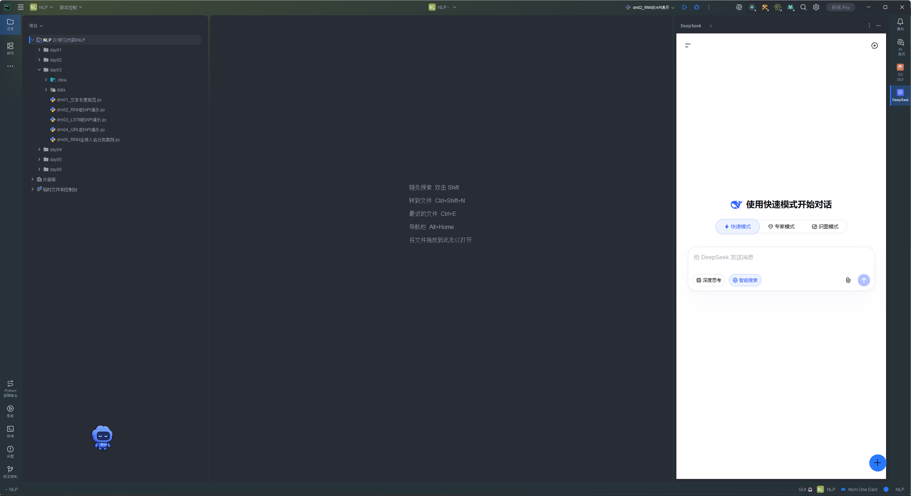
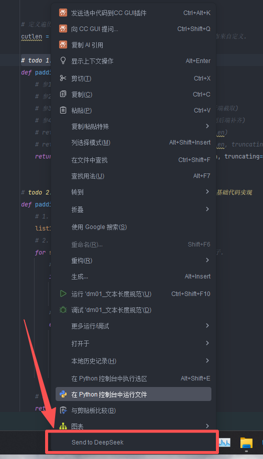
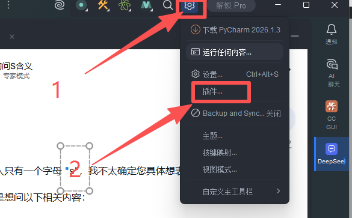
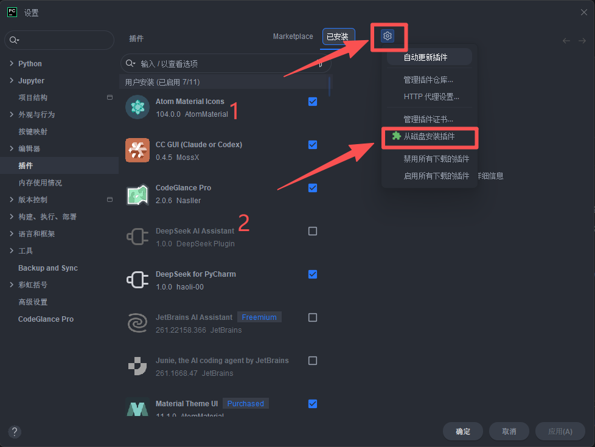
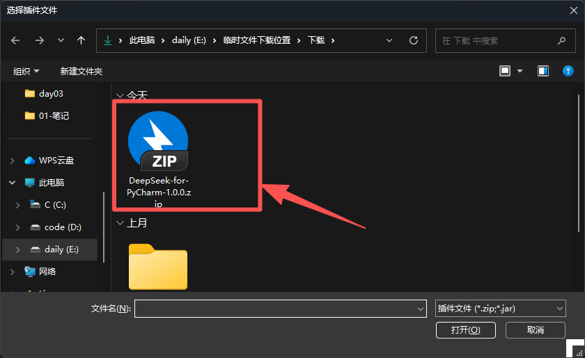
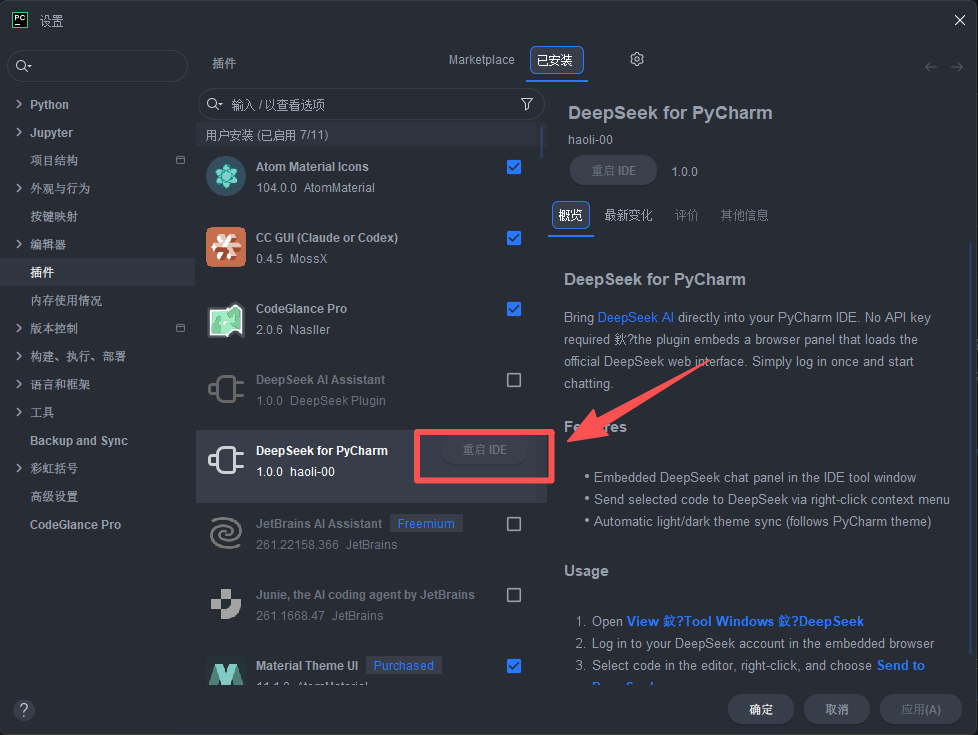

# DeepSeek for PyCharm（无需 API Key）

无需 API Key，在 PyCharm 中直接使用 [DeepSeek AI](https://chat.deepseek.com)。

本插件将 DeepSeek 网页界面嵌入为 PyCharm 工具窗口，支持右键一键发送代码片段到对话中。

---

## 功能特性 (Features)

- **嵌入式对话窗口** — DeepSeek 网页界面作为原生 PyCharm 工具窗口（View → Tool Windows → DeepSeek）
- **一键发送代码** — 编辑器中选中代码，右键选择「Send to DeepSeek」即可发送至对话输入框
- **主题自动同步** — 自动跟随 PyCharm 的亮色/暗色主题
- **无需 API Key** — 通过网页界面使用你的免费 DeepSeek 账号

## 界面截图 (Screenshot)



---

## 安装 (Installation)

### 从本地磁盘安装（适用所有 PyCharm 版本）

| 步骤 | 说明 | 配图 |
|------|------|------|
| 1 | 从 [Releases](https://github.com/haoli-00/deepseek-pycharm-plugin/releases) 下载最新 `.zip` 文件 | — |
| 2 | 打开 PyCharm → **Settings** → **Plugins** |  |
| 3 | 点击齿轮图标 ⚙ → **Install Plugin from Disk...** |  |
| 4 | 选择下载的 ZIP 文件 |  |
| 5 | 重启 PyCharm 使插件生效 |  |

### 从 JetBrains Marketplace 安装（上线后）

1. 打开 PyCharm → **Settings** → **Plugins** → **Marketplace**
2. 搜索「DeepSeek for PyCharm」
3. 点击 **Install** 并重启 PyCharm

---

## 使用方式 (Usage)

1. 打开工具窗口：**View → Tool Windows → DeepSeek**
2. 在嵌入的浏览器中登录你的 DeepSeek 账号
3. 在编辑器中选中代码片段
4. 右键 → **Send to DeepSeek**（或使用默认快捷键）

---

## 从源码构建 (Building from Source)

**前置条件**：JDK 17+

```bash
git clone https://github.com/haoli-00/deepseek-pycharm-plugin.git
cd deepseek-pycharm-plugin
./gradlew buildPlugin
```

构建产物位于 `build/distributions/DeepSeek-for-PyCharm-*.zip`。

---

## 兼容性 (Compatibility)

| 插件版本 | PyCharm 最低版本 | PyCharm 最高版本 |
|----------|:----------------:|:----------------:|
| 1.0.x    |      2023.2      |      2025.2+     |

---

## 许可证 (License)

本项目基于 MIT License 开源，详见 [LICENSE](LICENSE) 文件。

---

## 免责声明 (Disclaimer)

本项目与 DeepSeek 无任何关联。「DeepSeek」为其所属公司 DeepSeek 的商标。本插件仅为公开可用的网页服务提供便捷访问接口。
